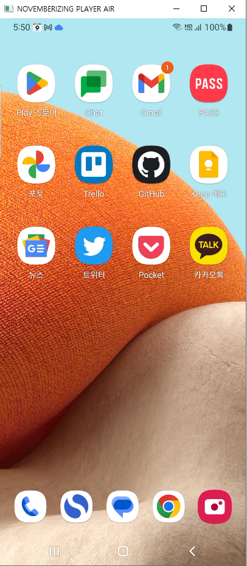

__NOVEMBERIZING AIR__
=====================

   

"NOVEMBERIZING AIR"는 안드로이드 기기를 컴퓨터에서 출력하고 제어하는 소프트웨어를 만드는 프로젝트입니다.



빌드 후에 실행을 하려면

```
adb exec-out screenrecord --time-limit -1 --bit-rate=64m --output-format=h264 --size=1080x2400 - | PlayerAir
```
